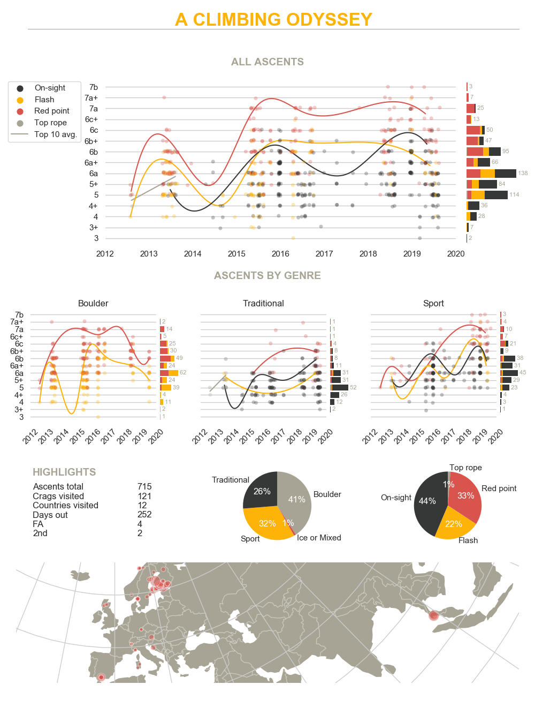

# 27 Stats

A set of tools to scrape and visualize a user's tick list from [27 Crags](https://www.27crags.com).



## Requirements

27 Stats depends on [Cartopy](https://scitools.org.uk/cartopy/docs/latest/index.html). Cartopy itself is installed when running the commands in the next section, but its own dependencies are not. These include atleast:

- [GEOS](https://trac.osgeo.org/geos/), and
- [PROJ](https://proj4.org/)

Refer to the original instructions to install.

## Installation

Install to a virtual environment using virtualenvwrapper.

```bash
mkproject 27stats
git clone https://github.com/tvalimaki/27stats.git .
pip install -r requirements.txt
```

## Usage

To scrape a user's tick list, display, and save the final visualization as a `.png` file, run

```bash
python py27stats.py -s username
```

The tick list must be public. See `python py27stats.py -h` for other options.

To just scrape a user's tick list and save it as a `.csv` file, the scraper can be run independently

```bash
scrapy crawl 27crags -a user=username
```

## License

Released under the [MIT License](LICENSE).